# SC 데이터 관리 DX 운영 체계 제안서

## 1. 제안 배경

현재 고객사 데이터는 네트워크 공유폴더에 집중되어 있으며, 별도의 NAS나 문서관리시스템 없이 일반 데스크탑을 사실상 파일 서버처럼 사용하고 있다.

이 방식은 초기에는 빠르고 단순하지만, 데이터가 누적될수록 다음 문제가 커진다.

| 구분 | 현재 문제 | 경영 리스크 |
|---|---|---|
| 데이터 위치 | 파일이 어디에 있는지 담당자 기억에 의존 | 담당자 변경/퇴사 시 업무 단절 |
| 최신성 | 최신 파일과 과거 파일 구분 어려움 | 잘못된 자료 기반 의사결정 |
| 권한 | 폴더 권한 중심의 느슨한 통제 | 민감 데이터 노출 위험 |
| 검색 | 파일명/폴더명 기반 수동 검색 | 업무 시간 낭비 |
| 보존 | 오래된 데이터가 계속 혼재 | 저장 비용 증가, 정리 불가 |
| AI 활용 | 문서 위치/권한/맥락이 정리되지 않음 | Graph RAG, AI 검색 도입 어려움 |

따라서 본 프로젝트의 핵심은 단순한 저장소 이전이 아니다.

> 회사 데이터를 "어디에 있고, 누가 접근 가능하며, 언제 보관/폐기되어야 하고, 어떻게 검색/활용할 수 있는지" 관리 가능한 자산으로 전환하는 DX 운영 체계 구축이다.

---

## 2. 전체 방향성

기존 데이터는 당장 모두 옮기지 않고 먼저 메타데이터화한다. 신규 데이터는 새로운 표준 저장 위치에 수집하고, 생성 시점부터 메타데이터와 권한 정책을 연결한다.

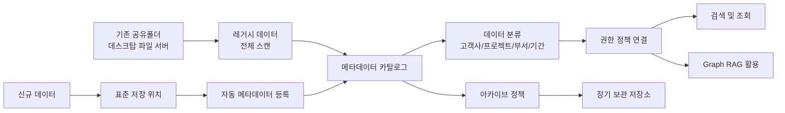

---

## 3. Before / After

### 현재 운영 방식

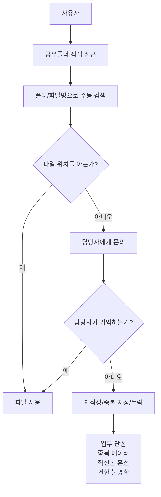

### 개선 후 운영 방식

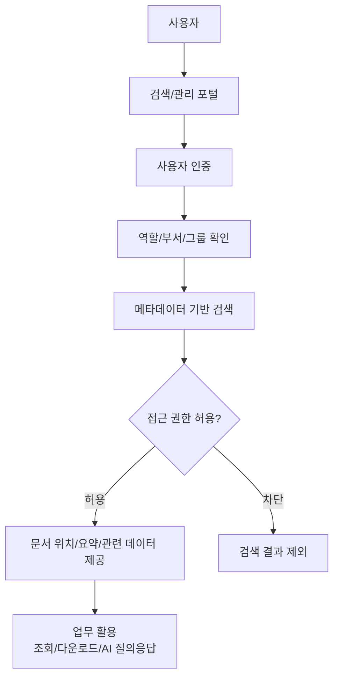

---

## 4. 목표 운영 모델

향후 데이터 운영은 "생성, 등록, 분류, 권한 적용, 검색, 보관"의 일관된 흐름으로 관리한다.

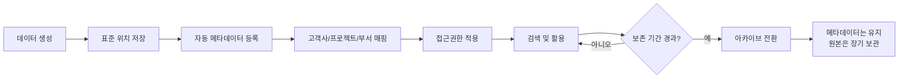

운영 원칙은 다음과 같다.

| 원칙 | 설명 |
|---|---|
| 원본 위치 추적 | 레거시 파일은 이동 전에도 현재 위치를 정확히 기록한다 |
| 자동 수집 | 신규 파일은 저장 시점부터 자동으로 등록한다 |
| 권한 우선 | 검색과 AI 활용 모두 RBAC 기준으로 제한한다 |
| 최신/장기 분리 | 최근 데이터와 장기 보관 데이터를 분리 운영한다 |
| 메타데이터 중심 | 오래된 데이터는 원본보다 메타데이터를 중심으로 찾고 관리한다 |

---

## 5. 레거시 데이터 운영 플로우

기존 공유폴더는 즉시 폐기하거나 전면 이전하지 않는다. 먼저 전체 현황을 파악하고, 회사가 통제 가능한 목록으로 전환한다.

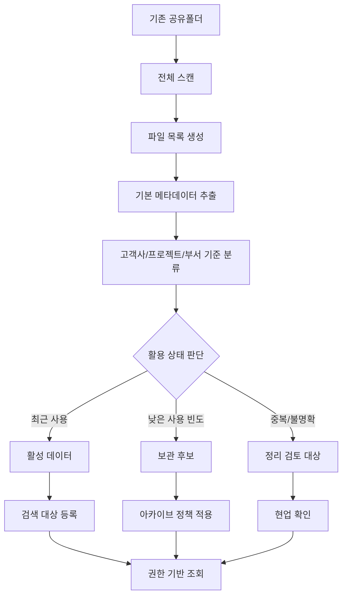

레거시 데이터 처리의 핵심 메시지는 다음과 같다.

> 기존 데이터를 당장 모두 옮기는 것이 아니라, 먼저 "찾을 수 있고 통제 가능한 상태"로 만든 뒤 중요도와 사용 빈도에 따라 단계적으로 이전/보관한다.

---

## 6. 신규 데이터 운영 플로우

신규 데이터는 초기부터 표준 정책에 맞게 저장한다. 사용자는 복잡한 시스템을 별도로 운영하기보다, 정해진 위치에 저장하면 시스템이 자동으로 관리하도록 설계한다.

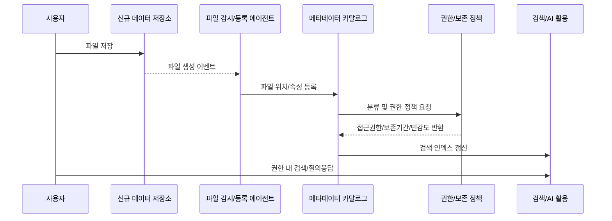

---

## 7. 실시간 트래킹 운영 구조

공유폴더는 이벤트 기반 감시와 주기적 전체 스캔을 함께 운영한다. 이벤트 감시는 빠른 반영을 담당하고, 주기적 스캔은 누락/장애/권한 변경을 보정한다.

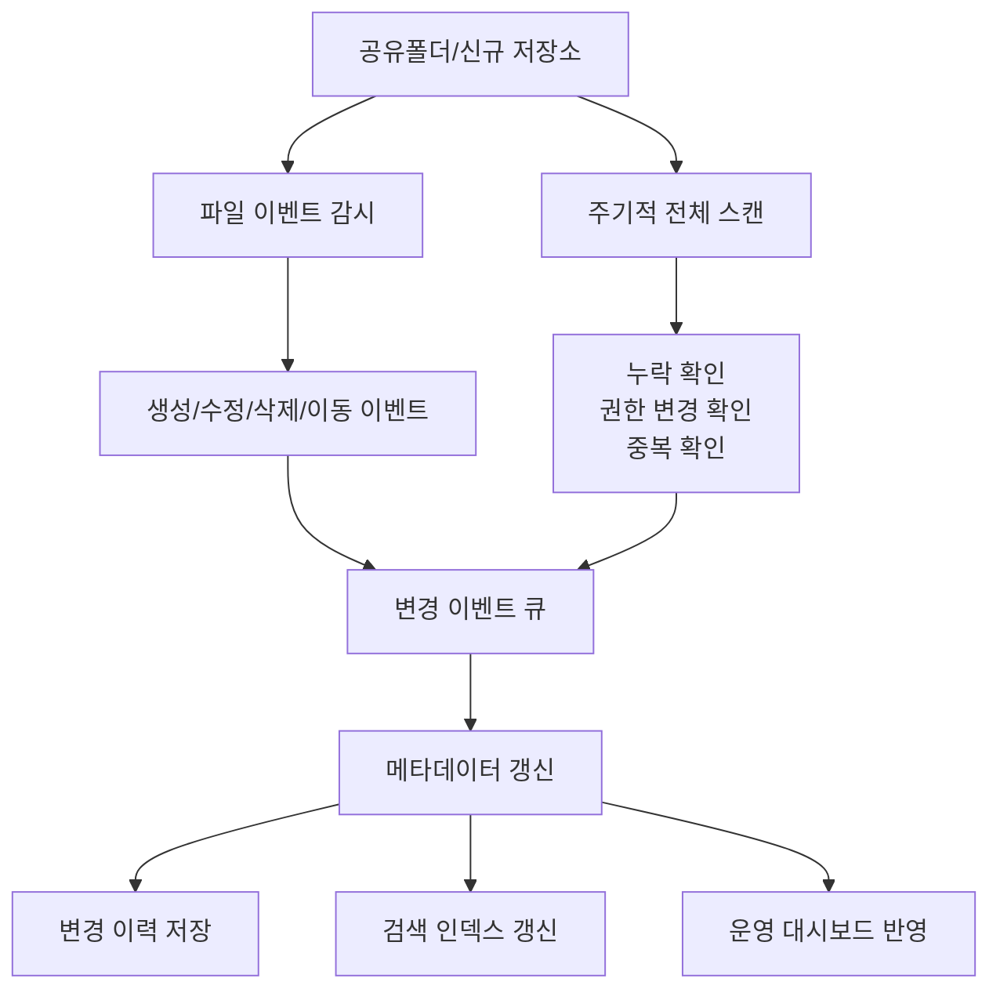

---

## 8. 데이터 라이프사이클 정책

데이터는 사용 빈도와 보존 필요성에 따라 Hot, Warm, Cold로 분리한다.

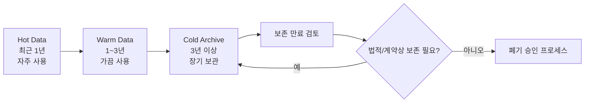

| 구분 | 대상 | 운영 방식 |
|---|---|---|
| Hot | 최근 1년, 진행 중 업무 | 빠른 접근, 클라우드/협업 저장소 중심 |
| Warm | 1~3년, 참조 가능성 있음 | 검색 가능, 접근 빈도 낮음 |
| Cold | 3년 이상, 장기 보존 | 원본은 아카이브, 메타데이터 중심 조회 |

단, 13개 내외의 부서가 함께 사용하는 회사 데이터 환경에서는 PARA만으로 전체 분류 체계를 구성하기에는 단순하다. PARA는 폴더 구조의 최상위 기준이 아니라, 데이터의 "운영 상태와 활용 목적"을 표현하는 메타데이터 축으로 적용한다.

즉, 실제 운영 분류는 부서, 고객사, 프로젝트, 문서유형, 권한, 보존정책을 함께 사용하는 다차원 메타데이터 모델로 설계한다.

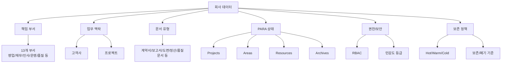

| 분류 축 | 의미 | 예시 |
|---|---|---|
| 책임 부서 | 데이터의 관리 책임 주체 | 영업, 재무, 인사, 운영, 품질 |
| 업무 맥락 | 데이터가 속한 고객사/프로젝트 | A고객사, 2026 유지보수 프로젝트 |
| 문서 유형 | 업무상 문서의 성격 | 계약서, 제안서, 견적서, 보고서, 도면 |
| PARA 상태 | 데이터의 활용 목적과 상태 | Projects, Areas, Resources, Archives |
| 권한/보안 | 누가 볼 수 있는지에 대한 기준 | 부서 권한, 프로젝트 참여자, 임원 권한 |
| 보존 정책 | 언제까지 Hot/Warm/Cold로 운영할지 | 최근 1년, 3년 보관, 7년 보존 |

PARA 관점은 다음과 같이 보조 분류로 적용한다.

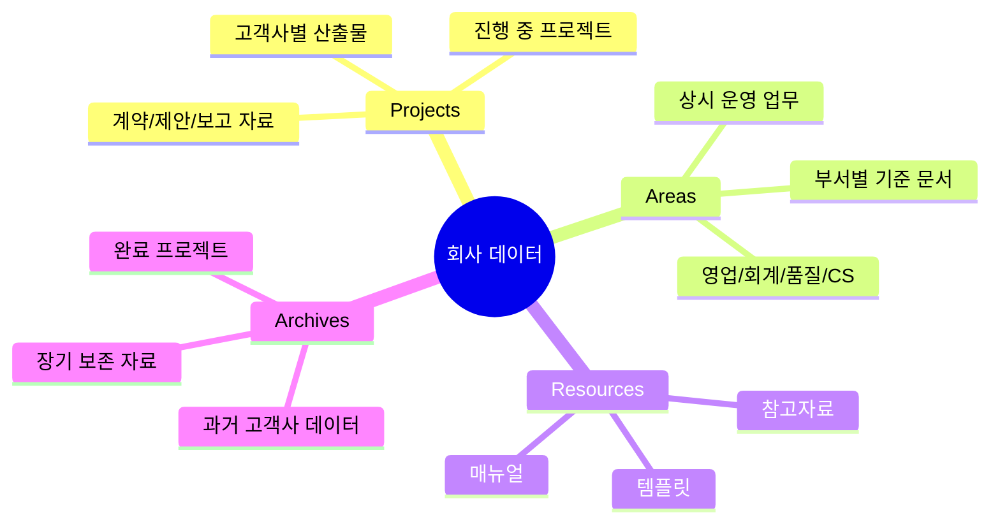

메타데이터 예시는 다음과 같다.

```yaml
file_path: "\\\\share\\sales\\client-a\\2026\\contract.pdf"
department: "영업"
owner_team: "영업1팀"
para_type: "Projects"
client: "Client A"
project: "2026 유지보수 계약"
document_type: "계약서"
sensitivity: "Confidential"
storage_tier: "Hot"
retention_period: "7년"
access_groups:
  - sales
  - legal
```

---

## 9. 접근권한 및 Graph RAG 운영

AI 검색과 Graph RAG는 반드시 권한 정책 위에서 동작해야 한다. 사용자가 접근할 수 없는 파일은 검색 결과, 요약, AI 답변의 근거 문서에 포함되지 않아야 한다.

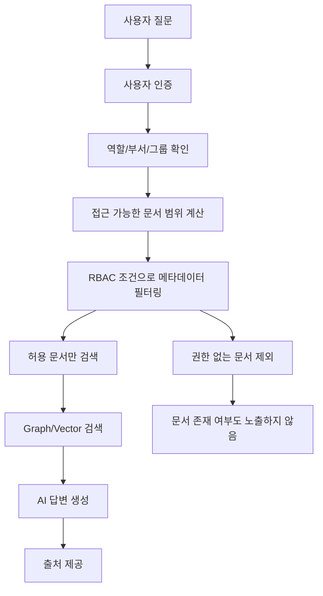

권한 정책의 기본 단위는 다음과 같다.

| 대상 | 기준 |
|---|---|
| 사용자 | 부서, 직무, 역할, 프로젝트 참여 여부 |
| 문서 | 고객사, 프로젝트, 민감도, 소유 부서 |
| 정책 | 허용 그룹, 차단 조건, 보존 기간, 감사 필요 여부 |

---

## 10. 운영 주체와 역할

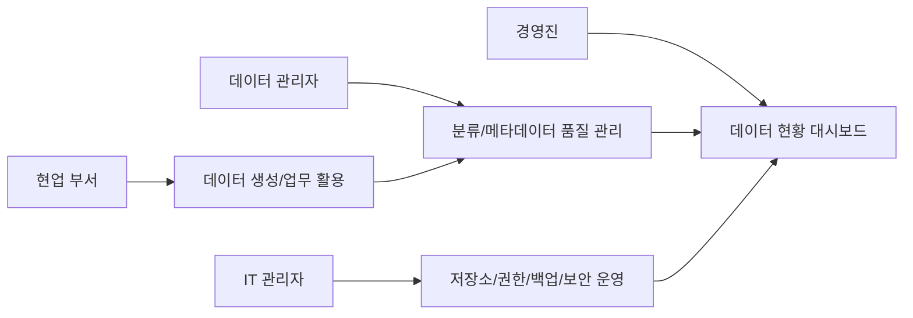

| 주체 | 주요 역할 |
|---|---|
| 경영진 | 데이터 리스크, 활용 현황, DX 성과 지표 확인 |
| 현업 부서 | 고객사/프로젝트 기준 데이터 생성 및 활용 |
| 데이터 관리자 | 분류 체계, 메타데이터 품질, 아카이브 기준 운영 |
| IT 관리자 | 저장소, 보안, 백업, 권한 연동, 시스템 안정성 관리 |

---

## 11. 단계별 도입 로드맵

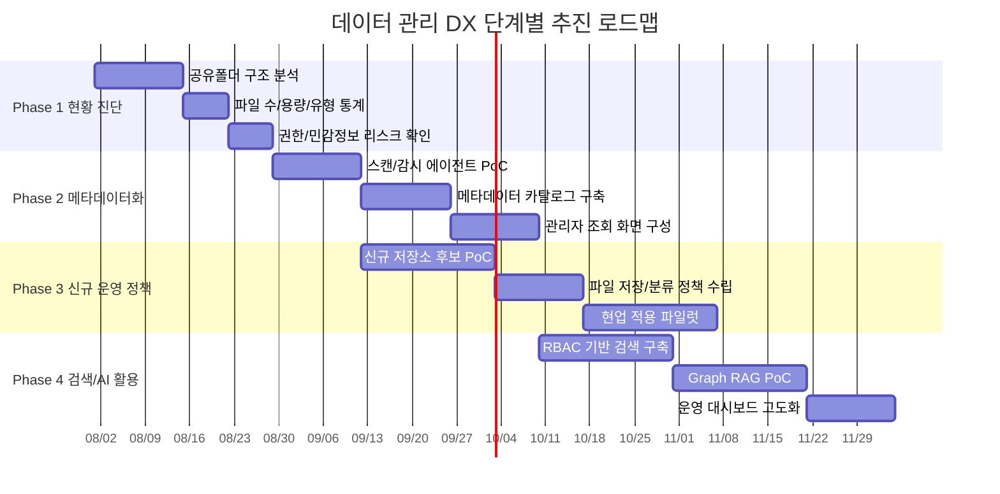

---

## 12. 경영진 의사결정 포인트

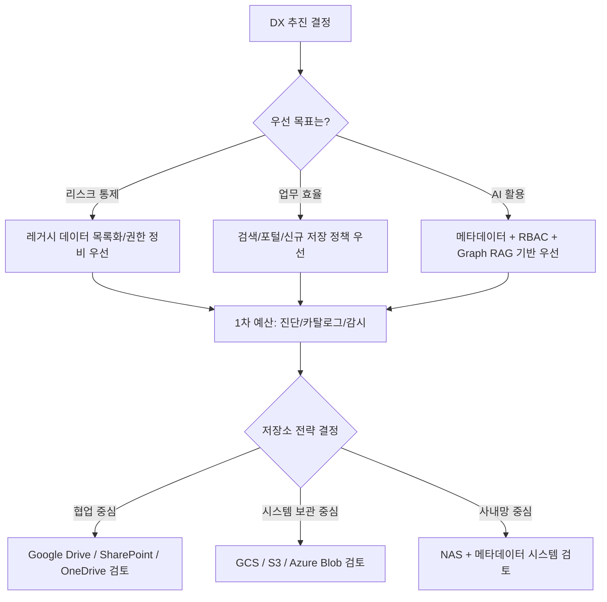

경영진이 결정해야 할 항목은 다음 4가지다.

| 의사결정 항목 | 선택지 |
|---|---|
| 우선순위 | 리스크 통제 / 검색 효율 / AI 활용 기반 |
| 저장소 방향 | 협업 저장소 / 오브젝트 스토리지 / NAS 병행 |
| 운영 책임 | IT 단독 / 현업+IT 공동 / 데이터 관리자 지정 |
| 적용 범위 | 특정 부서 파일럿 / 고객사 데이터 전체 / 전사 확대 |

---

## 13. 기대 효과

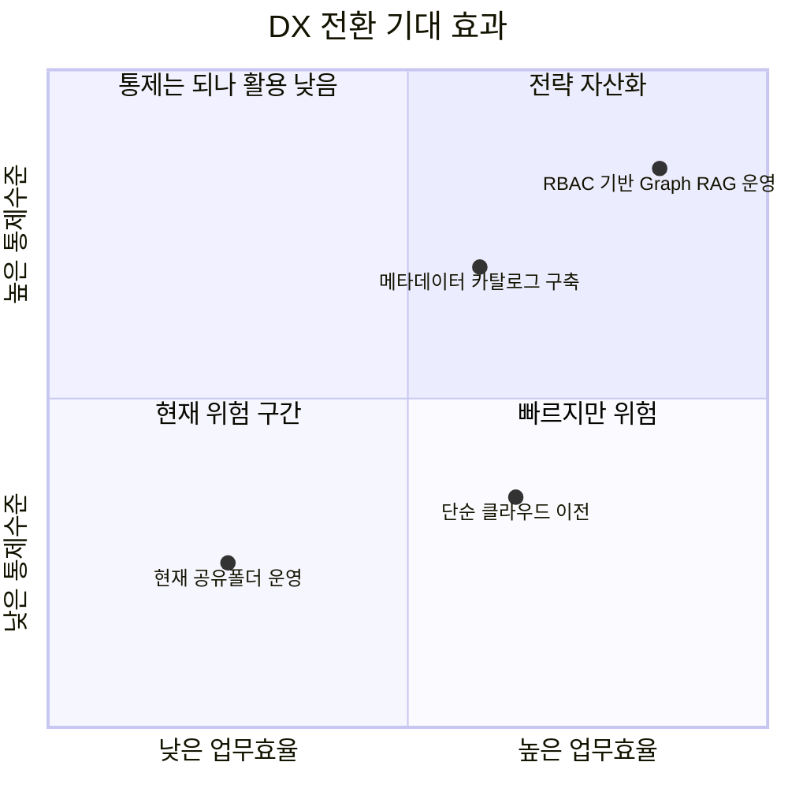

최종적으로 기대하는 변화는 다음과 같다.

| 영역 | 기대 효과 |
|---|---|
| 업무 연속성 | 담당자 기억에 의존하지 않고 데이터 위치 추적 가능 |
| 보안 | 권한 기반 검색과 접근 통제로 민감 데이터 노출 감소 |
| 생산성 | 고객사/프로젝트 단위 검색 시간 단축 |
| 비용 | 장기 데이터 아카이브로 저장소 비용과 혼재 문제 완화 |
| AI 활용 | Graph RAG, 문서 요약, 지식 검색 기반 확보 |
| 경영 관리 | 데이터 현황, 증가량, 보존 상태를 대시보드로 관리 |

---

## 14. 핵심 메시지

본 프로젝트는 저장소 교체 사업이 아니다.


회사의 데이터를 단순 보관 대상에서 관리 가능한 자산으로 전환하고, 이후 AI 검색과 Graph RAG까지 확장할 수 있는 운영 기반을 만드는 DX 프로젝트다.

---

## 연결
- [[sc]] — 제안 대상 회사
